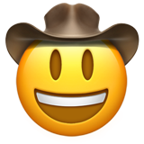

<h2>
    
    Hi there!
</h2>

I'm a 16-year-old programmer with proficiency in Python and JavaScript. In addition to coding, I enjoy playing chess and exploring the exciting world of machine learning and computer science from the comfort of my own home.

<h2>
    
    My journey
</h2>

My journey in programming began four years ago, and since then, I have expanded my skillset to encompass seven different programming languages. With each language, I strive to not only master its syntax but also understand its underlying philosophy and principles.

Programming has become more than just a hobby for me; it's a passion that drives me to constantly learn and grow. Whether I'm working on personal projects or contributing to open source initiatives, I take pride in writing clean, efficient, and elegant code.

<h2>
    
    Thank you!
</h2>

Thank you for taking the time to learn a bit about me. If you have any questions or would like to connect, feel free to reach out!

**look at my [website](https://shijian-wow.github.io/shijian-wow) for more informations**.
